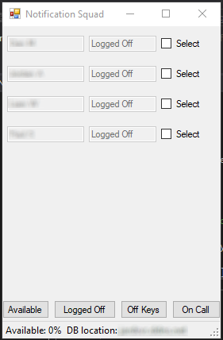
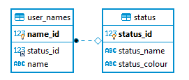

# Notification Squad

## Requirements:
A file in the core directory called host.txt
It should hold the server ip address or url.

A Windows PC.

At this time, only 4 Status are available to be Set.

Database Schema:

